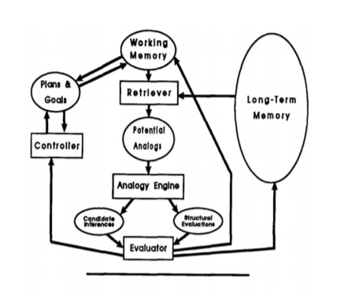

# TDT4137 - Øving 4 - Olav Reppe Husby

- [ ] 1.
  - [x] a)
  - [ ] b)
    - [x] 1
    - [ ] 2
    - [ ] 3
    - [ ] 4

- [ ] 2.
  - [ ] a)
  - [ ] b)
  - [ ] c)
  - [ ] d)
  - [ ] e)
- [ ] 3.
  - [ ] a)
  - [ ] b)
  - [ ] c)
  - [ ] d)

## Oppgave 1 &mdash; Icarus og CLARION

a) *Beskriv kort hovedmodulene i de kognitive arkitekturene ICARUS og CLARION*

**ICARUS**

ICARUS er en kognitiv arkitektur som fokuserer på fysiske agenter i en fysisk verden. ICARUS lenker kongnisjon til persepsjon og handlinger. Hovedmodulene i ICARUS er minne (kort- og langtids-) som bruker symbolske strukturer, og kognitiv prosessering (hente, velge, handling).

**CLARION**

ICARUS er en kognitiv arkitektur som fokuserer på en dualitet med tanke på representasjon av data, disse er eksplisitt og implisitt kunnskap. CLARION består av hovedmodulene ACS (Action-Centered Subsystem), NACS (Non Action-Centered Subsystem), MS (Motivational Subsystem), og MCS (Meta-Cognitive Subsystem).

b) *Gjør en sammenligning mellom de to arkitekturene med hensyn på*
1. *Underliggende filosofi og motivering*

  Icarus

  Den underliggende filosofien i Icarus er at man bør modellere et kognitivt system basert på realiteten, altså den fysiske verden.

  Icarus mener at langtidsminne og korttidsminne bør være forskjellige konsepter i et kognitivt system, siden de er forskjellige i virkelige hjerner. Icarus prøver også å bruke disse minnene på lignende måter som ekte hjerner, altså at de for eksempel bruker lignende minner for å "huske" andre minnner. De prøver også å etterligne hjernen ved å dele opp kognitiv prosessering i hente/velge/aksjon sykluser.

  Icarus prøver å skape et system som modellerer høyere nivå kognisjon hos mennesker, samtidig som det prøver å være konsistent med pykologi, prøver å framvise så mange menneskelige kognitive funksjoner som mulig, og skal kunne støtte intelligente agenter i mange forskjellige situasjoner.

  CLARION

  CLARION prøver å lage et system for menneskelig kognisjon med fokus på kognisjon, motivasjon, miljø interaksjonen. I CLARION prøver de å oppnå flere typer læring, slik som selvstendig-, top-down-, og bottom-up-læring. På denne måten håper de å etterligne menneskets kognisjon på best mulig måte. CLARION prøver å gjøre dette ved å dele opp systemet i subsystemene nevnt i forrige oppgave.

2. *Minnestrukturer (memories) - typer minner og hvordan innholdet representeres*

  ICARUS

  Representerer minne ved hjelp av symboler.

  Har working memory (WM), som består av persepsjon-buffere, blief memory, og korttidsminne.

  Bruker en hierarkisk struktur for langtidsminne.

  CLARION

   Representerer minne symolsk og sybsymbolsk.

   Bruker WM som midlertidig lagring.

   Langtidsminne består av en deklerativ (fastslått) del, og en procedural (genererbar) del.

3. *Kognitiv syklus – fra input til aksjon*

  ICARUS

  Perception -> Perceptual Buffer / Short Term Memory -> Goal Processing -> Skill Retrival and Selection -> Problem Soving and Learning -> Execution

  CLARION

  ???

## Oppgave 2 &mdash; Analogiresonnering

a) *Forklar følgende nøkkelord fra analogy reasoning*
1. *Analogi*
>"Analogy pervades all our thinking, our everyday speech
>and our trivial conclusions as well as artistic ways of
>expression and the highest scientific achievements."
> &mdash; <cite>Polya, How to Solve It, 1945</cite>

2. *Base*

  Base er startobjektet i analogier, altså utsagnet eller objektet man starter med.
3. *Bokstavelig likhet*

  Objekter som har mange like attributter, og som har mange like relasjoner.

4. *Relasjonell likhet*

  Objekter som har mange like relasjoner med andre objekter.

b) *Fyll inn for ???? i tabellen*

Mapping | Antall attributter mappet til målet | Antall relasjoner mappet til målet | Eksempel
--------|-------------------------------------|------------------------------------|---------
Bokstavelig Likhet|Mange|Mange|Solsystemet K5 er som Melkeveien
Analogi|Få|Mange|Et atom er som solsystemet vårt
Abstraksjon|Få|Mange|Atomet er et sentralkraftsystem
Anomall|Få|Få|Kaffe er som solsystemet vårt

c) *Forklar systematisitets-prinsippet («principle of systematicity»)*

  * Dette er at man gjerne gjør analogier basert på relasjoner i stedet for isolerte attributter.

  * Et predikat som passer inn i et system basert på relasjoner er med sannsynlig på bli valgt som måll enn et predikat basert på attributter.

  * Høyere orden relasjoner er mer ønskerlig enn lavere nivå relasjner.

d) *Analogien “En T er som en B” definerer en mapping fra basen B til målet T. Hvilke mapping- regler
foreslår Gentner (Gentner 1983) i sitt rammeverk for analogier?*

  * Retrieval
  * Elaboration
  * Justification
  * Mapping

e) *Figuren nedenfor viser en arkitektur for analogi-resonnering. Redegjør kort for MAC/FAC prinsippet,
og hvordan den virker. Hvordan er MAC/FAC koblet til Retriever og Analogy Engine
modulene?*

<!---->

  * MAC: Many Are Called, henting av "baser"
  * FAC: Few Are Chosen, velger få baser

## Oppgave 3 &mdash; Case-basert resonnering

a) *Hva er hovedprinsippet bak CBR?*

  Hovedprinsippet bar case based reasoning er at man skal gjenbruke tidligere løsninger for å løse nye problemer, og at man skal gjenbruke stegene som man brukte ved forrige løsning.

b) *Hvordan kan CBR kobles til menneskers kognisjon? Gi et par eksempler*

  CBR kan kobles til menneskelig kognisjon fordi ???

  * Humans are not relational planners
  * Human experts are not systems of rules
  * Human memory is story based

  **noe mer**

c) *Hva er en MOP i Dynamic Memory -modellen?*

  MOP: Memory Organisation Packages

  MOP er er en minnestruktur der minner organiseres etter likhet. MOP er generelle enheter som gjerne inneholder generell kunnskap, og spesifikke erfaringer med den kunnskapen. De gjør det slik fordi det menes at det er slik mennesker organiserer minner, ved at man har generell kunnskap om et tema, så har man eventuelt spesifikk kunnskap om temaet via erfaring.

d) *Hva er de viktigste prinsippene for indeksering av et nytt case i casebasen, iflg Dynamic
Memory?*

  De viktigste prinsippene for indeksering av et nytt case er at man bør lagre uventete aspekter i en situasjon, og at man lagrer handlinger basert på forskjeller fra den etablerte kunnskapen, altså om kunnskapen bryter normen, spesialiserer normen, eller generaliserer normen. Altså hvis man opplever en situasjon som er relatert til tidligere kunnskap, vil man ikke lære noe nytt hvis man opplever den samme situasjonen som man har opplevd før, men man vil lære noe nytt hvis situasjonen er forskjellig fra det man har lært før, for eksempel at man lærer noe som ikke passer inn i eksisterende kunnskap, eller at det passer inn, men er en mer spesialisert situasjon, eller en mer generell situasjon.
